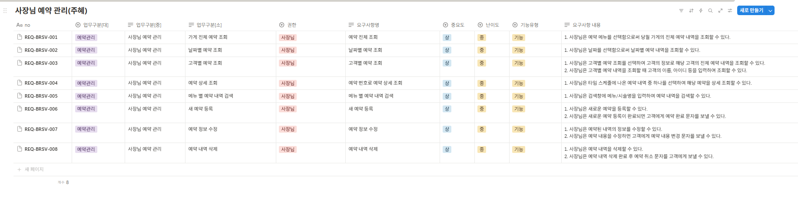

### ❗프로젝트 기간동안 작업 결과물(요구사항명세서)로 대신하여 교육 일지 작성 ❗

## 요구 사항 명세서

| 요구사항 ID       | 기능 영역   | 관리 영역             | 기능 이름             | 사용자   | 조회 방식            | 중요도 | 복잡도 | 기능 설명 |
|------------------|-------------|------------------------|------------------------|----------|-----------------------|--------|--------|----------|
| REQ-BRSV-001     | 예약관리    | 사장님 예약 관리      | 가게 전체 예약 조회   | 사장님   | 예약 전체 조회        | 상     | 중     | 사장님은 예약 메뉴를 선택함으로써 당월 가게의 전체 예약 내역을 조회할 수 있다. |
| REQ-BRSV-002     | 예약관리    | 사장님 예약 관리      | 날짜별 예약 조회       | 사장님   | 날짜별 예약 조회      | 상     | 중     | 사장님은 날짜를 선택함으로써 날짜별 예약 내역을 조회할 수 있다. |
| REQ-BRSV-003     | 예약관리    | 사장님 예약 관리      | 고객별 예약 조회       | 사장님   | 고객별 예약 조회      | 상     | 중     | 사장님은 고객별 예약 조회를 선택하여 고객의 정보로 해당 고객의 전체 예약 내역을 조회할 수 있다. 사장님은 고객의 이름, 아이디 등으로 조회할 수 있다. |
| REQ-BRSV-004     | 예약관리    | 사장님 예약 관리      | 예약 상세 조회         | 사장님   | 예약 번호로 조회      | 상     | 중     | 사장님은 타임 스케줄에 나온 예약 내역 중 하나를 선택하여 해당 예약을 상세 조회할 수 있다. |
| REQ-BRSV-005     | 예약관리    | 사장님 예약 관리      | 메뉴 별 예약 내역 검색 | 사장님   | 메뉴별 검색           | 상     | 중     | 사장님은 검색창에 메뉴/시술명을 입력하여 예약 내역을 검색할 수 있다. |
| REQ-BRSV-006     | 예약관리    | 사장님 예약 관리      | 새 예약 등록           | 사장님   | 새 예약 등록          | 상     | 중     | 사장님은 새로운 예약을 등록할 수 있으며, 예약 등록 후 고객에게 예약 완료 문자를 보낼 수 있다. |
| REQ-BRSV-007     | 예약관리    | 사장님 예약 관리      | 예약 정보 수정         | 사장님   | 예약 정보 수정        | 상     | 중     | 사장님은 예약된 내역의 정보를 수정하고 고객에게 변경 문자를 보낼 수 있다. |
| REQ-BRSV-008     | 예약관리    | 사장님 예약 관리      | 예약 내역 삭제         | 사장님   | 예약 내역 삭제        | 상     | 중     | 사장님은 예약 내역을 삭제할 수 있으며, 삭제 후 고객에게 예약 취소 문자를 보낼 수 있다. |

## 사진
