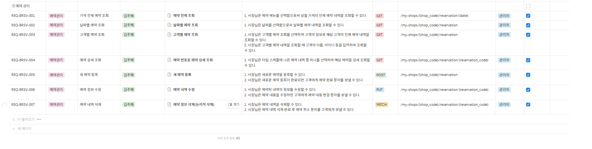

### ❗프로젝트 기간동안 작업 결과물(REST API 설계)로 대신하여 교육 일지 작성 ❗

## REST API 설계

| 요구사항 ID   | 기능 영역   | 기능 이름               | 작성자  | 조회 방식 / 기능 구분    | 기능 설명                                                                                                                                      | Method | API Endpoint                                                  | 권한     | 인증 필요 |
|--------------|--------------|--------------------------|---------|---------------------------|--------------------------------------------------------------------------------------------------------------------------------------------------|--------|----------------------------------------------------------------|----------|------------|
| REQ-BRSV-001 | 예약관리     | 가게 전체 예약 조회      | 김주혜  | 예약 전체 조회            | 사장님은 예약 메뉴를 선택함으로써 당월 가게의 전체 예약 내역을 조회할 수 있다.                                                               | GET    | /my-shops/{shop_code}/reservation/{date}                      | 관리자   | Yes        |
| REQ-BRSV-002 | 예약관리     | 날짜별 예약 조회          | 김주혜  | 날짜별 예약 조회          | 사장님은 날짜를 선택함으로써 날짜별 예약 내역을 조회할 수 있다.                                                                               | GET    | /my-shops/{shop_code}/reservation                             | 관리자   | Yes        |
| REQ-BRSV-003 | 예약관리     | 고객별 예약 조회          | 김주혜  | 고객별 예약 조회          | 사장님은 고객 정보로 고객의 전체 예약 내역을 조회할 수 있고, 고객의 이름, 아이디 등을 입력하여 조회할 수 있다.                               | GET    | /my-shops/{shop_code}/reservation                             | 관리자   | Yes        |
| REQ-BRSV-004 | 예약관리     | 예약 상세 조회            | 김주혜  | 예약 번호로 예약 상세 조회 | 사장님은 타임 스케줄에서 예약 내역 중 하나를 선택하여 해당 예약을 상세 조회할 수 있다.                                                       | GET    | /my-shops/{shop_code}/reservation/{reservation_code}         | 관리자   | Yes        |
| REQ-BRSV-005 | 예약관리     | 새 예약 등록              | 김주혜  | 새 예약 등록              | 사장님은 새로운 예약을 등록할 수 있으며, 등록 완료 후 고객에게 예약 완료 문자를 보낼 수 있다.                                                 | POST   | /my-shops/{shop_code}/reservation                             | 관리자   | Yes        |
| REQ-BRSV-006 | 예약관리     | 예약 정보 수정            | 김주혜  | 예약 내역 수정            | 사장님은 예약된 내역의 정보를 수정할 수 있고, 수정 후 고객에게 예약 내용 변경 문자를 보낼 수 있다.                                           | PUT    | /my-shops/{shop_code}/reservation/{reservation_code}         | 관리자   | Yes        |
| REQ-BRSV-007 | 예약관리     | 예약 내역 삭제            | 김주혜  | 예약 정보 삭제(논리적 삭제) | 사장님은 예약 내역을 논리적으로 삭제할 수 있으며, 삭제 완료 후 고객에게 예약 취소 문자를 보낼 수 있다.                                       | PATCH  | /my-shops/{shop_code}/reservation/{reservation_code}         | 관리자   | Yes        |

## 사진
