이번 글에서는 AWS EC2 인스턴스에 Docker, Docker Compose, Git을 설치하고 배포 환경을 구축하는 과정을 정리하려고 한다.

## **📋 개요**

AWS EC2에서 Docker를 사용하여 어플리케이션을 배포하기 위해서는 다음과 같은 구성 요소가 필요하다.

-   Docker CE(Community Edition)
-   Docker Compose
-   Git

---

## **1단계. EC2 인스턴스 접속**

Docker 설치하기 위해 로컬 CMD에서 SSH로 해당 인스턴스에 접속한다.

``` bash
# SSH 접속 명령어
ssh -i [ssh파일경로] ubuntu@[ec2 퍼블릭 IP 주소]
```

🚨 **SSH 접속 오류 해결(Window 환경)**

 SSH로 접속하는 과정에서 아래와 같은 에러를 만났다. 아래의 오류 메시지는 SSH 키 파일의 권한이 너무 열려있어 보안상 이유로 접속이 차단된다는 내용이다. 즉, SSH에서 개인 키 파일이 다른 사용자에게도 보일 수 있는 상태일 때 나오는 경고인데 이는 보안상 SSH는 .pem 파일을 소유자만 읽을 수 있게 설정되어야 있어야하기 때문이다.

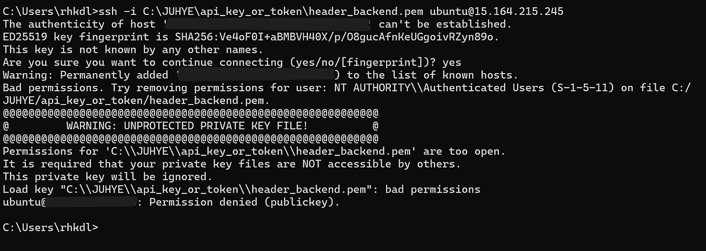

그래서 아래와 같은 명령어를 입력하여 해결하였다.

**💥Linux나 macOS에서는 보통 chmod 400 key.pem 명령으로 해결 가능하지만 Windows에서는 위 처럼 icacls 명령어로 접근 권한을 제한해야 한다.**

``` bash
# 권한 상속 제거
icacls "C:\JUHYE\api_key_or_token\header_backend.pem" /inheritance:r
# 현재 사용자에게만 읽기 권한(Read) 부여
icacls "C:\JUHYE\api_key_or_token\header_backend.pem" /grant:r "%USERNAME%:R"
# 다시 SSH 접속 시도
ssh -i [ssh파일경로] ubuntu@[ec2 퍼블릭 IP 주소]
```

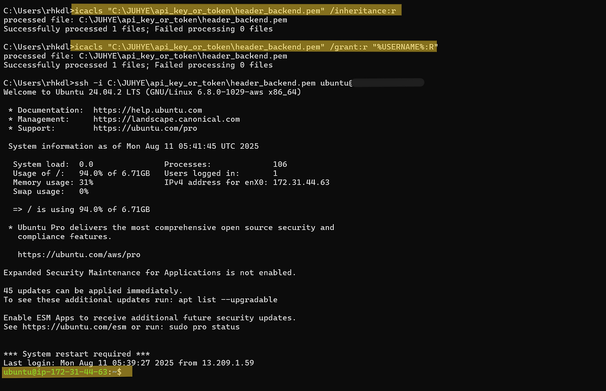

---

## **2단계. Docker 설치**

내가 생성한 EC2의 인스턴스는 Ubuntu로 생성되었기 때문에 apt, yum, curl과 같은 명령어를 활용하여 Docker를 설치해야 한다.

#### **2-1) 시스템 업데이트**

 우선 Docker 설치하기에 앞서 의존성 충돌을 방지하기 위해 시스템의 패키지 목록을 최신 상태로 업데이트한다.

``` bash
sudo apt update
```

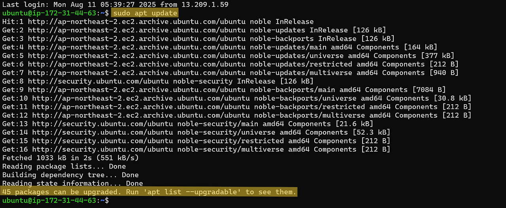

#### **2-2) 리눅스 시스템에 필요한 기본 도구 설치**

 아래의 명령어는 주로 새로운 패키지 저장소(PPA)를 추가하거나 Docker, Node.js, VS Code, etc 같은 서드파티 소프트웨어를 설치할 때 초기 세팅으로 사용된다. 즉, HTTPS를 통해 외부 저장소(PPA)에서 안전하게 패키지를 설치할 수 있게 환경을 준비하는 명령어이다. 더 쉽게 말하면 리눅스에서 외부 소프트웨어를 설치할 수 있게 도구들을 미리 깔아두는 명령어라고 할 수 있다.

``` bash
# -y : 모든 Yes/No 질문에 자동으로 Yes로 대답 -> 설치 도중 사용자에게 확인 없이 진행하게 한다.
# apt-transport-https : apt가 HTTPS를 통해 패키지를 다운로드 할 수 있도록 지원(보안 강화)
# ca-certificates : HTTPS 인증서의 유효성을 검사하기 위한 인증서들을 설치
# curl : 명령줄에서 웹 요청을 할 수 있게 해주는 도구 (ex. 파일 다운로드, API 호출 등)
# software-properties-common : add-apt-repository 같은 명령어를 사용할 수 있게 해주는 패키지. 
#                              보통 PPA 추가할 때 필요하다.
sudo apt install -y apt-transport-https ca-certificates curl software-properties-common
```

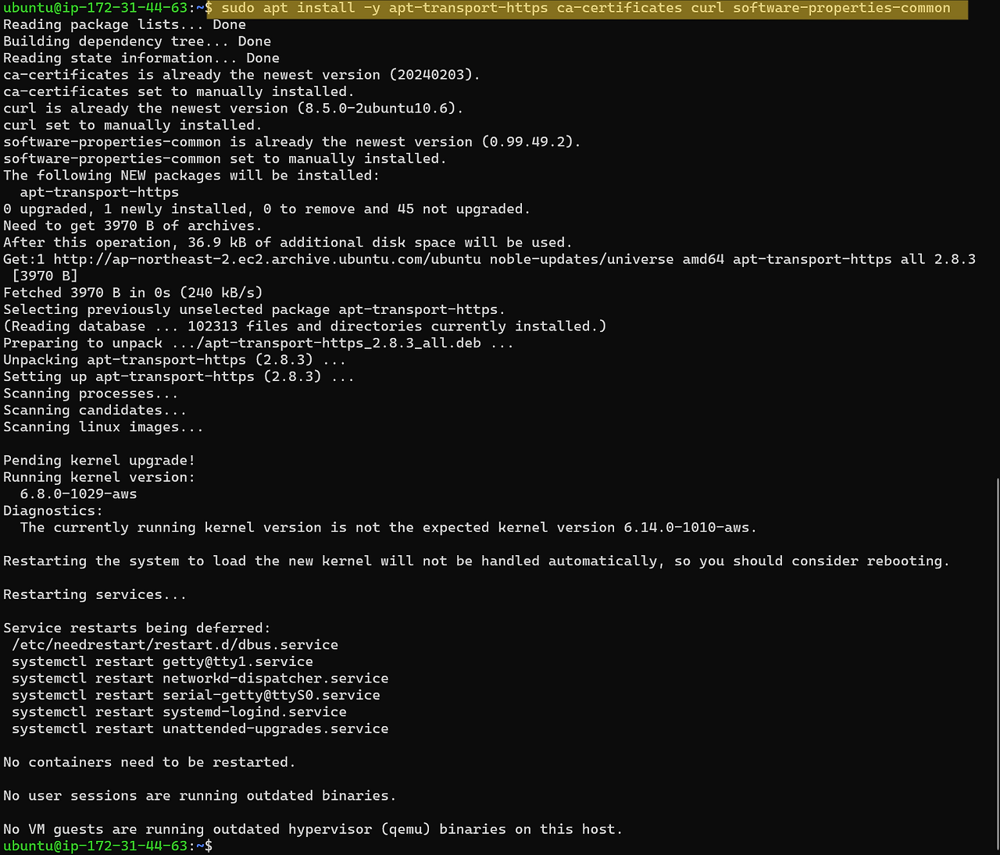

#### **2-3) Docker 공식 GPG 키를 시스템에 등록**

 리눅스에서 외부 저장소(레포지토리)를 추가할 때 보안 검증용 GPG 키를 먼저 설치해야 한다. 아래 명령어는 Docker 저장소의 GPG 키를 다운로드 하여 신뢰할 수 있는 형식으로 변환한 후 시스템에 설치하는 명령어이다.

``` bash
# curl -fsSL https://download.docker.com/linux/ubuntu/gpg  ->  Docker의 GPG 공개 키를 인터넷에서 다운로드 해서 출력
# curl : URL에서 데이터를 가져오는 명령어(다운로드 도구)
# -f : 실패 시 조용히 종료(fail silently)
# -s : 진행 상황 숨김(silent)
# -S : 오류 메시지는 출력(show errors
# -L : 리디렉션 따라가기(location)

# | : 파이프 -> 앞의 명령 결과를 뒤의 명령의 입력으로 전달

# sudo gpg --dearmor  ->  docker에서 제공하는 GPG 키는 .asc 같은 텍스트 형식인데 시스템은 .gpg같은 이진 형식을 선호하므로 변환 
# gpg : GNU Privacy Guard(암호화/서명 도구)
# --dearmor : ASCII-armored(텍스트) GPG 키를 이진 형식(.gpg) 으로 변환
# sudo : 관리자 권한으로 실행

# -o /usr/share/keyrings/docker-archive-keyring.gpg
# : 변환된 GPG 키를 /usr/share/keyrings/docker-archive-keyring.gpg 파일에 저장.
# -> 이 파일은 이후 Docker 저장소를 추가할 때 신뢰할 수 있는 저장소인지를 검증하는 데 사용.

# => 이 명령어는 Docker 공식 GPG 키를 안전한 바이너리 형식으로 시스템에 저장해서,
#    나중에 저장소 추가 시 보안 검증에 사용할 수 있도록 준비한다.
curl -fsSL https://download.docker.com/linux/ubuntu/gpg | sudo gpg --dearmor -o /usr/share/keyrings/docker-archive-keyring.gpg
```

#### **2-4) Docker 저장소 추가**

 이번 단계는 Docker의 공식 저장소(Repository)를 Ubuntu 시스템에 추가하는 단계이다. Docker 저장소란 Docker 설치와 업데이트에 필요한 패키지가 위치한 원격 서버이다. 하지만 Ubuntu의 기본 저장소에는 Docker의 최신 버전이 없기 때문에 Docker의 공식 저장소를 추가해줘야 한다. 즉,  Docker 패키지를 받을 수 있는 공식 저장소를 시스템에 등록하며 이후에 저장소가 신뢰할 수 있는 곳인지를 확인할 때 앞에서 설치한 GPG 키 파일을 사용한다.

``` bash
# echo "..."
# echo : 문자열 출력. 출력되는 문자열은 APT 저장소 주소이다.

# arch=$(dpkg --print-architecture) : 현재 시스템의 아키텍처를 자동으로 가져온다.

# $(lsb_release -cs) : 현재 Ubuntu 버전의 코드네임을 가져온다.
#                      즉 어떤 Ubuntu 버전인지 자동으로 입력하게 한다.

# signed-by=... : 저장소 서명을 검증할 때 사용할 GPG 키 파일 경로 지정
#                 앞 단계에서 생성한 경로를 사용한다.

# | sudo tee /etc/apt/sources.list.d/docker.list : 저장소 주소를 파일에 기록한다.
#                                                  sudo tee는 관리자 권한으로 파일에 쓰기 위함이다.

# > /dev/null : tee가 출력하는 내용을 화면에 보이지 않게 숨긴다
echo "deb [arch=$(dpkg --print-architecture) signed-by=/usr/share/keyrings/docker-archive-keyring.gpg] https://download.docker.com/linux/ubuntu $(lsb_release -cs) stable" | sudo tee /etc/apt/sources.list.d/docker.list > /dev/null
```

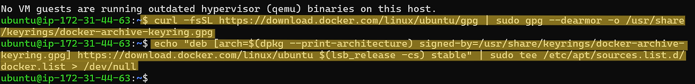

#### **2-5) Docker 설치**

 새로 추가한 Docker 저장소를 반영하기 위해 패키지 목록을 다시 업데이트 한 뒤 Docker의 Community 버전을 설치한다.

``` bash
sudo apt update

# 아래 명령줄은 docker-ce만 설치하는 것처럼 보이지만 실제로는 자동으로 관련된 필수 의존성도 함께 설치한다.
# (docker-ce, docker-ce-cli, containerer.io)
# docker-ce : Docker엔진(Community Edition) 설치
# docker-ce-cli : Docker 명령줄 도구(CLI)
# containerd.io : Docker가 사용하는 컨테이너 런타임
sudo apt install -y docker-ce
```

---

**🚨트러블 슈팅 : 디스크 용량 부족**

 디스크 용량 부족으로 Docker 설치 중 실패하였다.

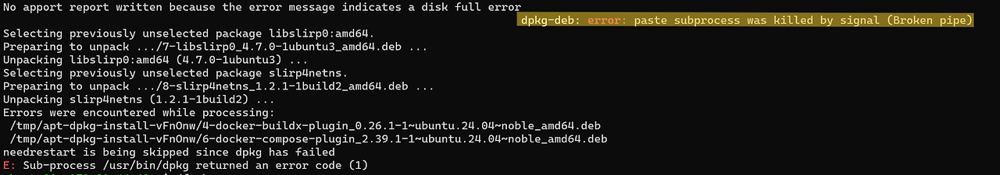

**💡 임시 해결 방법 : 시스템 정리 시도**

``` bash
# 용량 확인
df -h

# APT 패키지 캐시 삭제 -> /var/cache/apt/archives에 있는 .deb 캐시 파일들을 제거합니다.
sudo apt clean

# 오래된 로그 정리 -> 최근 3일치 로그만 남기고 오래된 systemd 로그 삭제
sudo journalctl --vacuum-time=3d

# 불필요한 패키지 제거 -> 더 이상 사용되지 않는 의존성 패키지 제거
sudo apt autoremove --purge

# 홈 디렉토리 정리 -> 유저 디렉토리에서 어떤 폴더가 가장 용량 많이 차지하는지 확인
#                    필요 없는 큰 파일이 있다면 삭제
du -sh ~/* | sort -hr
```

 위의 명령어처럼 오래된 캐시나 로그 정리하였음에도 불구하고 여전히 용량이 부족한 상태였다.

**💡 근본적 해결 방법 : EBS 볼륨 확장**

 그래서 디스크(EBS) 리사이즈를 하였다. 현재 생성된 인스턴스의 디스크 크기는 8GB이다. 이걸 20GB로 확장할 것이다.

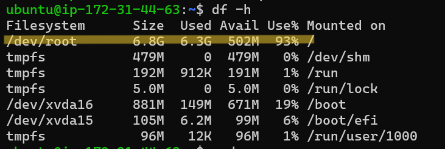

**1\. AWS 콘솔에서 볼륨 크기 증가.**

> **1\. AWS EC2 콘솔 접속**  
>    EC2 → 인스턴스 → 현재 인스턴스 선택 → 아래로 스크롤 → "스토리지" 탭 클릭  
>   
> **2\. 루트 볼륨 선택 (/dev/xvda)**  
>    "볼륨 ID" 클릭 → EBS 콘솔로 이동 작업 > 볼륨 수정 클릭 크기: 원하는 GB로 증가 (예: 20GB)  
>   
> **3\. 저장 후 적용**  
>    수 분 내로 상태가 "사용 가능"으로 바뀜

**2\. 인스턴스 내에서 파일시스템 확장**

``` bash
# 1. 파티션 크기 늘리기
sudo growpart /dev/xvda 1

# 2. 파일시스템 확장
sudo resize2fs /dev/xvda1
```


**3\. Docker 재설치**

``` bash
# 이전 설치 도중 중단되었던 패키지들 설정을 마저 정리
sudo dpkg --configure -a

# 시스템에 설치되지 못한 의존성 패키지를 자동으로 설치
sudo apt install -f

# Docker 엔진 다시 설치
sudo apt install -y docker-ce
```

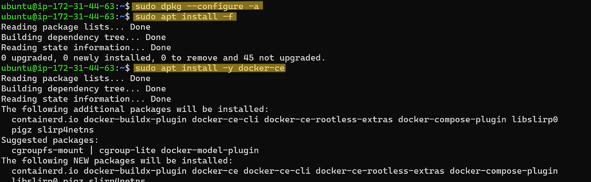

---

#### **2-6) Docker 버전 확인**

아래 사진처럼 Hello from Docker! 문구가 나오면 Docker 설치가 성공적으로 완료된 것이다.

``` bash
# 버전 확인
docker --version

# 테스트 확인
sudo docker run hello-world
```

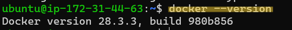

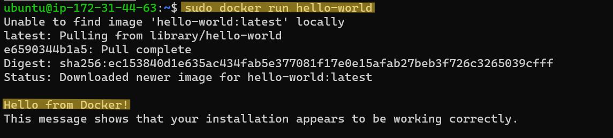

---

## **3\. Docker Compose 설치**

 Docker 20.10+ 버전에서는 Docker Compose가 플러그인으로 자동 통합된다. 그래서 별도 설치가 필요 없는 경우가 대부분이다. 그래서 Docker Compose가 통합되어 설치 되었는지 확인하기 위해 버전 확인을 먼저 했더니 Docker 설치할 때 Docker Compose도 같이 설치가 되어 아래와 같이 버전이 나오는 것을 알 수 있다.

``` bash
# Docker Compose 버전 확인
docker compose version
```
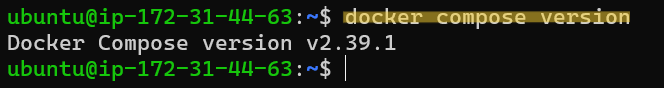

---

## **4\. Git 설치**

Git 설치는 간단하게 설치할 수 있다. 

#### **3-1) 패키지 목록 업데이트**

``` bash
sudo apt update
```

#### **3-2) Git 설치**
 
``` bash
sudo apt install git -y
```

#### **3-3) 설치 확인**

``` bash
git --version
```


---

## **🎉이제 AWS EC2 인스턴스에서 Docker를 사용할 준비가 완료되었다.**