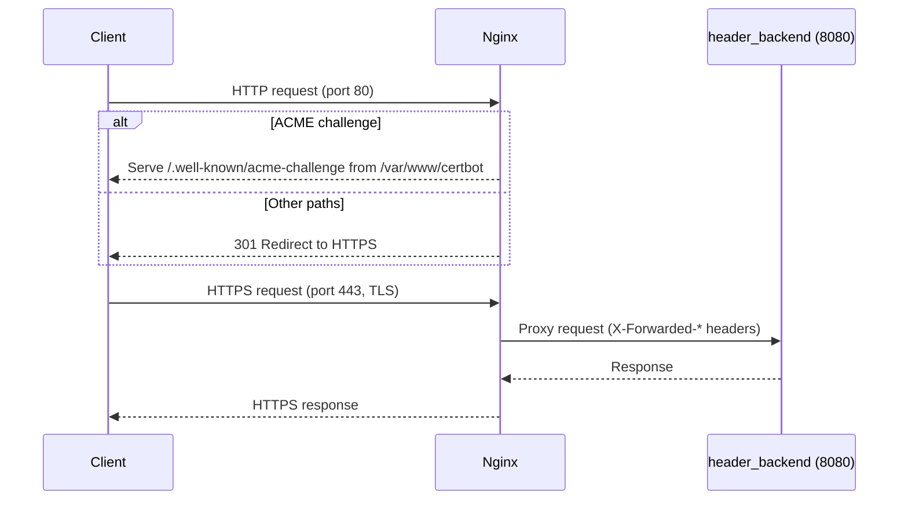
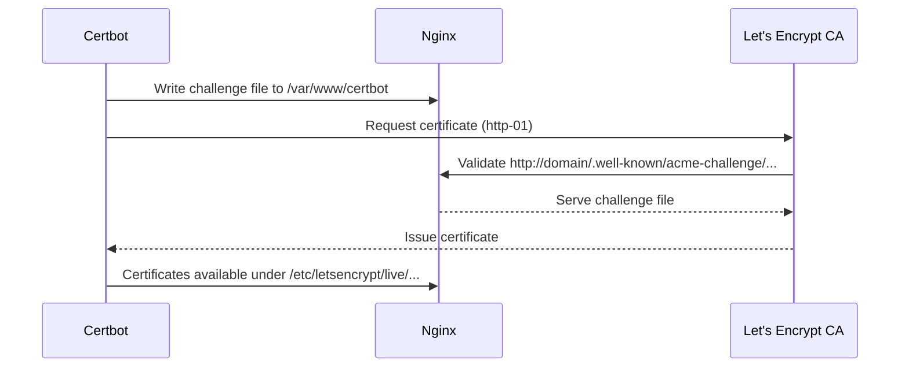

### ❗프로젝트 기간동안 작업 결과물(PullRequest)로 대신하여 교육 일지 작성 ❗

## PR 타입(하나 이상의 PR 타입을 선택해주세요)

- [X] 기능 추가  

## 👍변경점

NGINX + Certbot 설정 추가(HTTPS 인증서 발급 받기 위해)

<!-- This is an auto-generated comment: release notes by coderabbit.ai -->

## Summary by CodeRabbit

- New Features
  - API에 HTTPS 적용 및 HTTP→HTTPS 리다이렉트 도입(api.headercrm.site).
  - 프록시/인증서 관리용 Nginx·Certbot 서비스 추가.
  - CORS 허용 도메인에 https://headercrm.site, https://www.headercrm.site 추가.
- Chores
  - 배포 파이프라인에서 환경변수 파일 초기화 방식 조정(첫 줄 덮어쓰기)으로 작성 순서 정리.
  - Docker Compose에 새 네트워크(webnet) 구성 및 백엔드 연결.

<!-- end of auto-generated comment: release notes by coderabbit.ai -->

<!-- This is an auto-generated comment: summarize by coderabbit.ai -->
<!-- walkthrough_start -->

## Walkthrough
배포 워크플로우에서 .env 초기 작성 방식을 >로 변경했습니다. Docker Compose에 nginx와 certbot 서비스를 추가하고 webnet 네트워크를 도입했습니다. Nginx 리버스 프록시와 TLS 설정 파일을 추가했습니다. Spring Security CORS 허용 도메인을 headercrm.site(WWW 포함)로 갱신했습니다.

## Changes
| Cohort / File(s) | Change Summary |
|---|---|
| **CI/CD .env 초기화 변경** `.github/workflows/deploy.yml` | .env 생성 시 첫 줄 연산자를 >>에서 >로 변경하여 파일을 초기화 후 나머지 라인을 append하도록 수정. |
| **NGINX/Certbot 통합 및 네트워킹** `docker-compose.yml`, `nginx/conf.d/default.conf` | nginx(alpine) 리버스 프록시와 certbot 서비스 추가, webnet 네트워크 도입 및 header_backend 연결. HTTP→HTTPS 리다이렉트, ACME 챌린지 경로 매핑, TLS(1.2/1.3) 종단 및 백엔드 프록시 설정. |
| **보안/CORS 도메인 갱신** `src/main/java/.../SecurityConfig.java` | CORS 허용 오리진에서 Vercel 도메인 제거, https://www.headercrm.site 및 https://headercrm.site 추가. localhost:3000 유지. |

## Sequence Diagram(s)

## Estimated code review effort
🎯 3 (Moderate) | ⏱️ ~15–25 minutes

## Possibly related issues
- BOA-with-elephant/Header-backend#189: NGINX 리버스 프록시 및 Certbot 기반 TLS 도입 요구사항과 정확히 일치하는 구성 추가.

## Poem
> 새벽 포트에 불 켜진 443,  
> 바람은 80에서 속삭여 리다이렉트하라—  
> 녹색 자물쇠, 챌린지의 길을 지나  
> 프록시 너머로 응답이 돌아오네.  
> 헤더는 정갈히, 오리진은 새로이.  
> 밤하늘엔 certbot, 파도처럼 Nginx.

<!-- walkthrough_end -->
<!-- internal state start -->

<!-- DwQgtGAEAqAWCWBnSTIEMB26CuAXA9mAOYCmGJATmriQCaQDG+Ats2bgFyQAOFk+AIwBWJBrngA3EsgEBPRvlqU0AgfFwA6NPEgQAfACgjoCEYDEZyAAUASpETZWaCrI5Ho6gDYkuAbQBiAKIAgtAAqjaBALqQZgCMABwAnJDBtPQAckTwGAAeqRj0AMKUuAL4uJBF+BgAZvBEkJAGYYiUXABSYQASAJqBAAxJAEwArE0GGY4C7ZBxSQMTEQAyXLC4uNyIHAD0O9m4sNgCGkzMOwBCAPLBYADu6rBgJN7csJi4O90kaEoUYAI0AwANZkWg7bjYTyeHbzAbuBDISHQyAUEgAR2w0kqqGYzlB9DQyDQkFqP1w2DR6HS6ngNQ0MFgJEY7wwpBQGFwFEU2AY0kgGQA4gBJDIADXQhSqpXKlSYdQalOodKwBEgh2ZvHwIjE6vwkDIKm8/AEuG0GByjW60GgVgAyoxSvB6gxqNIGXBmQ4BMx1DQ+G1vGI6OqmZAAESABjrAKVNkEAKbOAABrw5AABRk6iU5m/JS0ACU1jsuFk3CzUqUiAYFHgM3oGpZmHZRIjQtFEoA1NKKGUKpBACSDgFQJ+MJlPW20OwAe44BcycAOIOQQA4PYBIOsggGweyOQQAg44AXVdz4Y0Rn0xnAUDB/FqOAIxDIyho9DObE5XF4Jp14ikMnkTD+KjUmm0ujAhgmFAcCoKgmDnoQpDkFQN4KKw7BcFQdz2I4eIuJAcgKF+qjqFoOgHoepgGBoBxHAIOx3PgFDArUnj4HciA7Eo3B0bIGiyMwnhuOGPEGBYqTCpe0FuvQDhOOh+BngwrKkIg7iUfwDAMJSaIYHyyCIA8uDSaS3LMOg3AloUlp6vwUgUHcVbiGyobMvUFCIJUng5Mykm2ZAGhkBIpLwMatCUiZzGsfenD7pAwqqmGOS0mgnj2KIaK4BpNDcAANO59mOZAznkJAGD0ZA2BtMgegeV5HKOT89BuXopWeRgEh7lAEXuQAIiQLH4PIaqBEUwz2Cl6V1plTkuXlBVFfydXlTklW/KekC1WVDV7gYFyiGgk38BgnjdWGI2QJZ6jMpNJVDWG9XefUxqoFy2BqSJGEkLUVHMkd1mNHatiioKAD6rWhMEdpXBERSBL9KzpWgtT+odCA6XWaJ4tFNkSM48BGvyzhZoZYIhk2MwvWiDIZPqFRMnwdHZAw/B8LRBXSQ27pGOYljBJ4/rKjUyBqnWSgMJ4zhcxgyBuSQuTcFRsFUTwxzOTT7C0tIYWk+QXD5fWbL8mq4uS12dAQnL8AK5y6jyPzgswSqyBKDQwb0DkoaoLQzq1KtgSOfAeKwZ+zJohI8AkMhz1E5wkAALJ0PAjgGDx4b7kRtD4CClBgGckttOxnHcbx/HBIJUHXiGYlofIbmM1rckGFAaS0MSeVB3l2R5PFFAB3yqZsjkuQcLF3AufmvNhknKf/On+BtPFFLcIdjwKJy5qUL9GBoGw6XMFC4gscyEj4J4jjMsw+D3UlpIy/K9SNJgt5Oi6bqIOlo5WF8Nr2jwUvICmCQDOlAAsv8AGZcxQ0gMxPGaky5YCZL8JegIU6FChlKagZppLazDG0NuxtmRDzeiQAQ5BKgEMotRJqqR0j13IMhPkXZZSt3bsyFM1DuyfCYbKfMWlYCQF3vvNgkAj4n2QETR0XZnTGzdKA6gaAQHKUciwA0nIXCSxyJUQ41BICgg6jzMM8ozQuT4BQe6Fo2SIMJBsIETIeb6jrHcPBBCG64GIcCUhYRuC0Hvu5aBfxfpwNBFKDB9DTJCHwI7axtiSCEPCY41M2ZkBEKosCbYuhDphNwLmUhEUuQ8nUugBuyECDcDAN4KQcU4nUTyqvEMNj8HhMlISRAiAGgixQJUO4FNmTkDoHQUh4ccgyyJt7D6OxHIGLEEqOKvwhBFVwCFYkKiwwnjcsNXy2D9QW2xu5Sh9jHEAG53LMFkIgdEngwBuLNFwveB9UQkGRk0tZaJaCrVZqkDm15ramT5qIS2wtRZnl1lLEMMtIQCHlvI8Q4hlbV0gHaSgATsx0C4AAAy7nkBFHJIAIpHqCMeLAM4kCzp4BFkLoWYI7nC2giLWEVFRY7DFycsVpxxRPPFHECVEphVg+wjSMxUmwK4kSiLPGwKBL42g1KsC0tHgy5guL8WosAEmE1IczotKQkrgUAqkEMJVADIkT4mKvheijV4SxXosxancemcWWEoMB7cQ3sQy+yuQHRuIcpZcEji7GOccE5gCMMi3IOwL4aHBEoWom0OanBqLUHO8c84FyvDBYuqFnBlykjJCFtdiRYCyN3eel8lTiBqJ3ZuAag0hueuGzQF9B7vFCpCwIEsmVZsgE/OhlBtrvy7JAb+Z8+BoH7hoQVFBKzMA0A0mgbgmhQGJW+SAyxwkAHJkCBDUooyowQijh0CPWaEZB2RokxNiQRelIA7DRhQCidw7iBplD2NROwNA2OhGAYE+U7gYB2ECNgad3i7q1g+gwU7IA2CjmiMQxIUTk3bQerEjlLEttfg6DhOSAEDDiFcl2YHNBhQbbi5tT8HT+PbUWvWlR/4AN7QZeAg6qqUBHWO46k6kkrsxsgO0dpliz0OMI8Qd8aDIDoq6WC97wkMB2N4JKZBKzFk+M5KQn6B1Dvo+OkgOxahQk8IzHIGgSz6Wvqe0T4nwltFXTJ8TkhVP9uo0pigo6VMQirBIUEbFdN7iAyuom2ToDLAdFqAgTBPDIG83aCQcQND9X08F0LGgKP6dOjkhARAnhtGUlZD88A3jtocMdVM9TPC/QYBlimyBujCkFN0DgIA0AZDCMsVYIBw6tVGGkwDSSrDclyIHCDcUYNHtMusTYuwdhDu8cKsEHBv7f3SkTO4zgXZsiY0B7oE9KhDta0BsUYAQOxTAMKKw62kmbf8FRWbFAcxgGOxQA7UAjsnbm3QMA7WKj4CMNUBRe9SR0TuG4KArbetwfeegnL6z7nwCwyGNUBH0riz5Nwddm7t2Mz/fujEsHT6tONpw9ZRH6C1BPXWSllRMOiAIC4UhBGrmHoB+srUnWIdWLDD4k8/iOXIcctfObPAOvyCHVm+gwX1SUF9CvQtWAiomXnbgQAmATLtM3Dxg9zFaxUQKtPOLyrbc0B8yO53yFp/P1tVPgQKQWK3BVXbV+p9c3kNsC42oKzagM+ULUXyAj4u3qF02OvFq5EUQMOnYNydhCDQGjQNLBhu0YvUOz9eBYBh4VEQHY0LUtmze5fDQwe0Yxr4mzeNwlYIlxTQtCuslXvptrGGIoVwbAOgvoqDXWBHbJ4CkWNPDRI0OTb0QAtKo7TH2HSQFMuYfvAeufgKQFeszQnogCqszdIADa2ENodYA8c1BoIUMAfd3gaHMnyTwWhDKkNrhDhSmzYpfdnw0WaawNhL72Feu4NGYHDtswxmgtSF93+2HsGzdnjqkIga6LkCT4Gidaew2QX4z6G7X5QJ35DaCaxSwArYcCoYDCLCMIsAhSFR8o3gtZQBXAah8BV415TwfSfy86f5sCHCKCID5hIzmiFRqTl6PI57PKcwu5a6O4CzO5vJiyNoG60yyy24mxgpdYqz6gl7az6gNJEAi6Zg/JgGkYGzG526m5dbuyez2q3iKB+wkDOrBy1ChzupRxere4ERATyLVRnibQXiFyJo6HwQPiohoDISF7oSYS+xUA4S/j4QAQGCWF3jqC/TwB1y/T+yBw2K0C/Ts5doWFHiQBjAAJoBoCJC1C0BxAkAAKZFxDpEkC/xxAAKjACBJAkBoajBxC0AABsaAAA7GgAkMML/I0bUf+IYAEQkUEbgCEWEREUHHQL9CeAeJYcwAwNwAVuvuLN0bEZUARAivMQYAAN6tbhizQNDrCIDhh+BRCpQrGnZGJECbHbEGAAC+Bg8x1qIxYxExnIUxgxUo+gQAA=== -->

<!-- internal state end -->
<!-- finishing_touch_checkbox_start -->

✨ Finishing Touches

- [ ] <!-- {"checkboxId": "7962f53c-55bc-4827-bfbf-6a18da830691"} --> 📝 Generate Docstrings

🧪 Generate unit tests

- [ ] <!-- {"checkboxId": "f47ac10b-58cc-4372-a567-0e02b2c3d479", "radioGroupId": "utg-output-choice-group-unknown_comment_id"} -->   Create PR with unit tests
- [ ] <!-- {"checkboxId": "07f1e7d6-8a8e-4e23-9900-8731c2c87f58", "radioGroupId": "utg-output-choice-group-unknown_comment_id"} -->   Post copyable unit tests in a comment
- [ ] <!-- {"checkboxId": "6ba7b810-9dad-11d1-80b4-00c04fd430c8", "radioGroupId": "utg-output-choice-group-unknown_comment_id"} -->   Commit unit tests in branch `189-feature-add-nginx-and-certbot-config`

<!-- finishing_touch_checkbox_end -->
<!-- tips_start -->

---

🪧 Tips

### Chat

There are 3 ways to chat with [CodeRabbit](https://coderabbit.ai?utm_source=oss&utm_medium=github&utm_campaign=BOA-with-elephant/Header-backend&utm_content=190):

- Review comments: Directly reply to a review comment made by CodeRabbit. Example:
  - `I pushed a fix in commit <commit_id>, please review it.`
  - `Open a follow-up GitHub issue for this discussion.`
- Files and specific lines of code (under the "Files changed" tab): Tag `@coderabbitai` in a new review comment at the desired location with your query.
- PR comments: Tag `@coderabbitai` in a new PR comment to ask questions about the PR branch. For the best results, please provide a very specific query, as very limited context is provided in this mode. Examples:
  - `@coderabbitai gather interesting stats about this repository and render them as a table. Additionally, render a pie chart showing the language distribution in the codebase.`
  - `@coderabbitai read the files in the src/scheduler package and generate a class diagram using mermaid and a README in the markdown format.`

### Support

Need help? Create a ticket on our [support page](https://www.coderabbit.ai/contact-us/support) for assistance with any issues or questions.

### CodeRabbit Commands (Invoked using PR/Issue comments)

Type `@coderabbitai help` to get the list of available commands.

### Other keywords and placeholders

- Add `@coderabbitai ignore` anywhere in the PR description to prevent this PR from being reviewed.
- Add `@coderabbitai summary` to generate the high-level summary at a specific location in the PR description.
- Add `@coderabbitai` anywhere in the PR title to generate the title automatically.

### CodeRabbit Configuration File (`.coderabbit.yaml`)

- You can programmatically configure CodeRabbit by adding a `.coderabbit.yaml` file to the root of your repository.
- Please see the [configuration documentation](https://docs.coderabbit.ai/guides/configure-coderabbit) for more information.
- If your editor has YAML language server enabled, you can add the path at the top of this file to enable auto-completion and validation: `# yaml-language-server: $schema=https://coderabbit.ai/integrations/schema.v2.json`

### Status, Documentation and Community

- Visit our [Status Page](https://status.coderabbit.ai) to check the current availability of CodeRabbit.
- Visit our [Documentation](https://docs.coderabbit.ai) for detailed information on how to use CodeRabbit.
- Join our [Discord Community](http://discord.gg/coderabbit) to get help, request features, and share feedback.
- Follow us on [X/Twitter](https://twitter.com/coderabbitai) for updates and announcements.

<!-- tips_end -->

## 이미지

